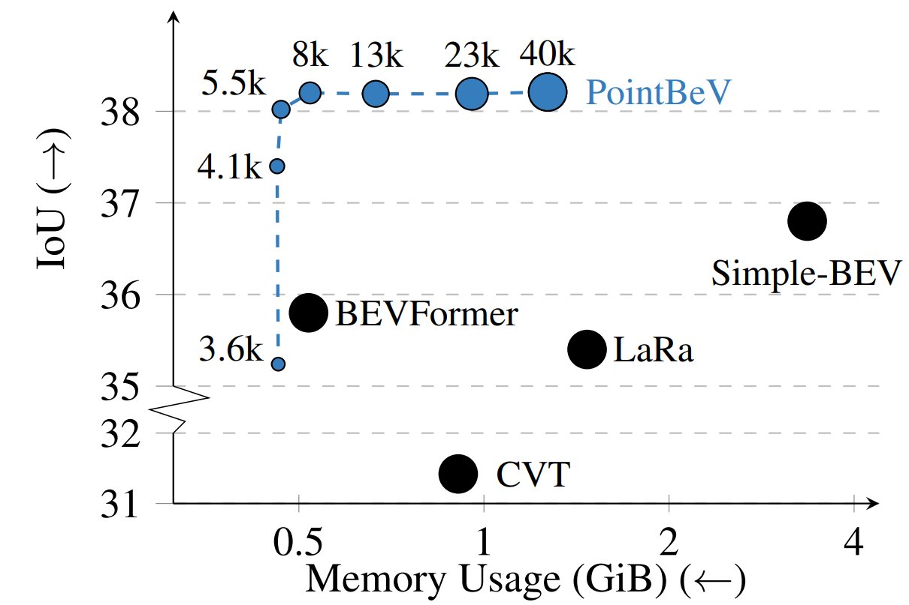
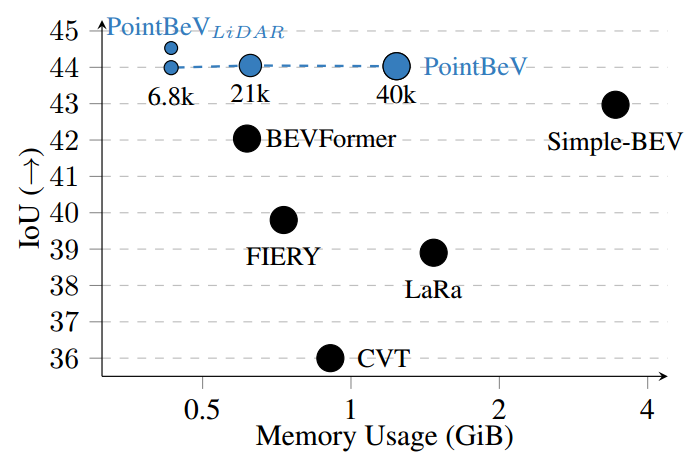
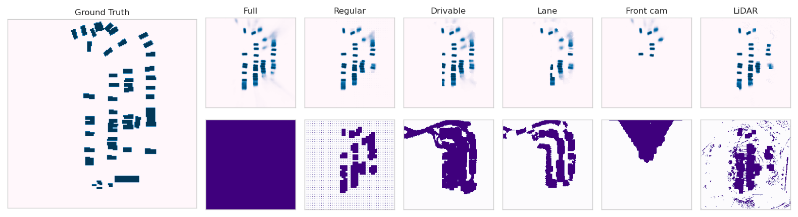
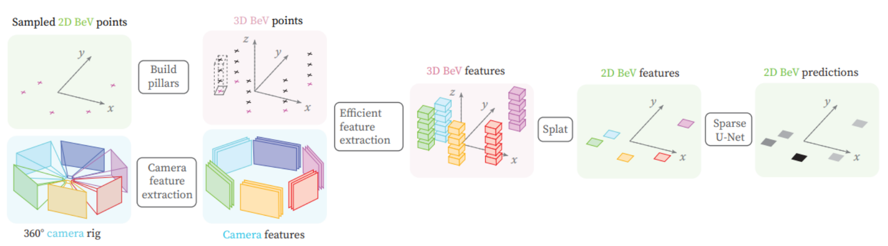

# PointBeV: A Sparse Approach to BeV Predictions
    
</figure>

<table>
  <tr>
    <td align="center">
      
    </td>
    <td align="center">
      
    </td>
  </tr>

  <tr>
    <td align="center">
      <em>PointBeV reaches state-of-the-art on several segmentation tasks (vehicle without filtering above) while allowing a trade-off between performance and memory consumption.</em>
    </td>
    <td align="center">
      <em>PointBeV reaches state-of-the-art on several segmentation tasks (vehicle with filtering above). It can also be used using different pattern strategies adapted to the problem.</em>
    </td>
  </tr>

  <tr>
  <td colspan="2" align="center">
    
  </td>

  <tr>
    <td colspan="2" align="center">
      <em>Illustration of different sampling pattern, respectively: a full, a regular, a drivable hdmap, a lane hdmap, a front camera and a LiDAR pattern. PointBeV is flexible to any pattern.</em>
    </td>
  </tr>

</tr>
</table>

# Abstract
*We propose PointBeV, a novel sparse BeV segmentation model operating on sparse BeV features instead of dense grids. This approach offers precise control over memory usage, enabling the use of long temporal contexts and accommodating memory-constrained platforms. PointBeV employs an efficient two-pass strategy for training, enabling focused computation on regions of interest. At inference time, it can be used with various memory/performance trade-offs and flexibly adjusts to new specific use cases. PointBeV achieves state-of-the-art results on the nuScenes dataset for vehicle, pedestrian, and lane segmentation, showcasing superior performance in static and temporal settings despite being trained solely with sparse signals.*

# Architecture overview

</figure>

<table>
  <tr>
  <td align="center">
    
  </td>
  </tr>
  
  <tr>
  <td align="center">
    <em>PointBeV architecture is an architecture dealing with sparse representations. It uses an efficient Sparse Feature Pulling module to propagate features from images to BeV and a Sparse Attention module for temporal aggregation.</em>
  </td>
  </tr>

</table>

# Next steps

Stay informed, the code will soon be released.
