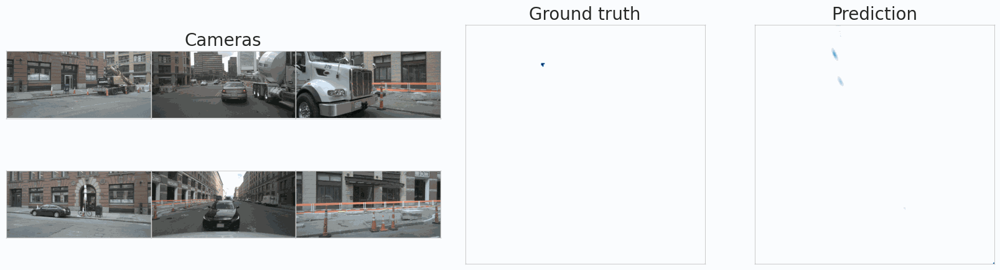

# Official PyTorch Implementation of *PointBeV: A Sparse Approach to BeV Predictions*


> [**PointBeV: A Sparse Approach to BeV Predictions**](https://arxiv.org/abs/2312.00703)<br>
> [Loick Chambon](https://loickch.github.io/), [Eloi Zablocki](https://scholar.google.fr/citations?user=dOkbUmEAAAAJ&hl=fr), [Mickael Chen](https://sites.google.com/view/mickaelchen/), [Florent Bartoccioni](https://f-barto.github.io/), [Patrick Perez](https://ptrckprz.github.io/), [Matthieu Cord](https://cord.isir.upmc.fr/).<br> Valeo AI, Sorbonne University


<div align="center">
<table>
  <tr>
    <td align="center">
      
    </td>
    <td align="center">
      
    </td>
  </tr>

  <tr>
    <td align="center">
      <em>PointBeV reaches state-of-the-art on several segmentation tasks (vehicle without filtering above) while allowing a trade-off between performance and memory consumption.</em>
    </td>
    <td align="center">
      <em>PointBeV reaches state-of-the-art on several segmentation tasks (vehicle with filtering above). It can also be used using different pattern strategies, for instance a LiDAR pattern.</em>
    </td>
  </tr>

  <tr>
  <td colspan="2" align="center">
    
  </td>

  <tr>
    <td colspan="2" align="center">
      <em>Illustration of different sampling patterns, respectively: a full, a regular, a drivable hdmap, a lane hdmap, a front camera and a LiDAR pattern. PointBeV is flexible to any pattern.</em>
    </td>
  </tr>

</tr>
</table>
</div>

# Abstract
*We propose PointBeV, a novel sparse BeV segmentation model operating on sparse BeV features instead of dense grids. This approach offers precise control over memory usage, enabling the use of long temporal contexts and accommodating memory-constrained platforms. PointBeV employs an efficient two-pass strategy for training, enabling focused computation on regions of interest. At inference time, it can be used with various memory/performance trade-offs and flexibly adjusts to new specific use cases. PointBeV achieves state-of-the-art results on the nuScenes dataset for vehicle, pedestrian, and lane segmentation, showcasing superior performance in static and temporal settings despite being trained solely with sparse signals.*

<table>
  <tr>
  <td align="center">
    
  </td>
  </tr>
  
  <tr>
  <td align="center">
    <em>PointBeV architecture is an architecture dealing with sparse representations. It uses an efficient Sparse Feature Pulling module to propagate features from images to BeV and a Sparse Attention module for temporal aggregation.</em>
  </td>
  </tr>

</table>

## ✏️ Bibtex

If this work is helpful for your research, please consider citing the following BibTeX entry and putting a star on this repository.

```
@misc{chambon2023pointbev,
      title={PointBeV: A Sparse Approach to BeV Predictions}, 
      author={Loick Chambon and Eloi Zablocki and Mickael Chen and Florent Bartoccioni and Patrick Perez and Matthieu Cord},
      year={2023},
      eprint={2312.00703},
      archivePrefix={arXiv},
      primaryClass={cs.CV}
}
```

## Updates:
* 【28/02/2024】 Code released.
* 【27/02/2024】 [PointBeV](https://arxiv.org/abs/2312.00703) has been accepted to CVPR 2024.


# 🚀 Main results

### 🔥 Vehicle segmentation
PointBeV is originally designed for vehicle segmentation. It can be used with different sampling patterns and different memory/performance trade-offs. It can also be used with temporal context to improve the segmentation.
<div align="center">
<table border="1">
  <caption><i>Vehicle segmentation of various static models at 448x800 image resolution with visibility filtering. More details can be found in our paper.</i></caption>
    <tr>
        <th>Models</th>
        <th><a href="https://arxiv.org/abs/2312.00703">PointBeV (ours)</a></th>
        <th><a href="https://openaccess.thecvf.com/content/CVPR2023/html/Pan_BAEFormer_Bi-Directional_and_Early_Interaction_Transformers_for_Birds_Eye_View_CVPR_2023_paper.html">BAEFormer</a></th>
        <th><a href="https://arxiv.org/abs/2206.07959">SimpleBeV</a></th>
        <th><a href="https://arxiv.org/abs/2203.17270">BEVFormer</a></th>
        <th><a href="https://arxiv.org/abs/2205.02833">CVT</a></th>
    </tr>
    <tr class="highlight-column">
        <td>IoU</td>
        <td>47.6</td>
        <td>41.0</td>
        <td>46.6</td>
        <td>45.5</td>
        <td>37.7</td>
    </tr>
</table>
</div>
Below we illustrate the model output. On the ground truth, we distinguish vehicle with low visibility (vis < 40%) in light blue from those with higher visibility (vis > 40%) in dark blue. We can see that PointBeV is able to segment vehicles with low visibility, which is a challenging task for other models. They often correspond to occluded vehicles.


We also illustrate the results of a temporal model on random samples taken from the NuScenes validation set. The model used for the visualisation is trained without filtering, at resolution 448x800.


### ✨ Sparse inference

PointBeV can be used to perform inference with fewer points than other models. We illustrate this below with a vehicle segmentation model. We can see that PointBeV is able to perform inference with 1/10 of the points used by other models while maintaining a similar performance. This is possible thanks to the sparse approach of PointBeV. In green is represented the sampling mask. Predictions are only performed on the sampled points.


### 🔥 Pedestrian and lane segmentation

PointBeV can also be used for different segmentation tasks such as pedestrians or hdmap segmentation.
<div align="center">
<table border="1">
  <caption><i>Pedestrian segmentation of various static models at 224x480 resolution. More details can be found in our paper.</i></caption>
    <tr>
        <th>Models</th>
        <th><a href="https://arxiv.org/abs/2312.00703">PointBeV (ours)</a></th>
        <th>TBP-Former</th>
        <th>ST-P3</th>
        <th>FIERY</th>
        <th>LSS</th>
    </tr>
    <tr class="highlight-column">
        <td>IoU</td>
        <td>18.5</td>
        <td>17.2</td>
        <td>14.5</td>
        <td>17.2</td>
        <td>15.0</td>
    </tr>
</table>
</div>


### 🔥 Lane segmentation
<div align="center">
<table border="1">
  <caption><i>Lane segmentation of various static models at different resolutions. More details can be found in our paper.</i></caption>
    <tr>
        <th>Models</th>
        <th><a href="https://arxiv.org/abs/2312.00703">PointBeV (ours)</a></th>
        <th>MatrixVT</th>
        <th>M2BeV</th>
        <th>PeTRv2</th>
        <th>BeVFormer</th>
    </tr>
    <tr class="highlight-column">
        <td>IoU</td>
        <td>49.6</td>
        <td>44.8</td>
        <td>38.0</td>
        <td>44.8</td>
        <td>25.7</td>
    </tr>
</table>
</div>

## 🔨 Setup <a name="setup"></a>

➡️ Create the environment.
```bash
git clone https://github.com/...
cd PointBeV
micromamba create -f environment.yaml -y
micromamba activate pointbev
```

➡️ Install cuda dependencies.
```bash
cd pointbev/ops/gs; python setup.py build install; cd -
```

➡️ Datasets.

We used nuScenes dataset for our experiments. You can download it from the official website: https://www.nuscenes.org/nuscenes.
```bash
mkdir data
ln -s $PATH/nuscenes data/nuScenes
pytest tests/test_datasets.py
```

➡️ Backbones:

Backbones are downloaded the first time the code is run. We've moved them to a folder so that we can retrieve the weights quickly for other runs.
```bash
wget https://download.pytorch.org/models/resnet50-0676ba61.pth -P backbones
wget https://download.pytorch.org/models/resnet101-63fe2227.pth -P backbones
wget https://github.com/lukemelas/EfficientNet-PyTorch/releases/download/1.0/efficientnet-b4-6ed6700e.pth -P backbones
```

**Optional:**
Preprocess the dataset to train HDmaps model.
Building hdmaps 'on the fly' can slow down the dataloader, so we strongly advise you to save the preprocessed dataset.
```bash
python pointbev/data/dataset/create_maps.py --split val train --version=trainval
python pointbev/data/dataset/create_maps.py --split mini_val mini_train --version=mini
```

The directory will be as follows.
```
PointBeV
├── data
│   ├── nuScenes
│   │   ├── samples
│   │   ├── sweeps
│   │   ├── v1.0-mini
|   |   ├── v1.0-trainval
|   |── nuscenes_processed_map
|   |   ├── label
|   |   |   ├── mini_train
|   |   |   ├── mini_val
|   |   |   ├── train
|   |   |   ├── val
|   |   ├── map_0.1
```

## 🔄 Training <a name="training"></a>

Sanity check.
```bash
pytest tests/test_model.py
```

Overfitting.
```bash
python pointbev/train.py flags.debug=True task_name=debug
```

Training with simple options:
```bash
python pointbev/train.py \
model/net/backbone=efficientnet \ # Specifiy the backbone
data.batch_size=8 \ # Select a batch size
data.valid_batch_size=24 \ # Can be a different batch size to faster validation
data.img_params.min_visibility=1 \ # With or without the visibility filtering
data/augs@data.img_params=scale_0_3 \ # Image resolution
task_name=folder # Where to save the experiment in the logs folder.
```

If you want to train with the reproduced code of BeVFormer static (by specifying `model=BeVFormer`), do not forget to compile the CUDA dependency.
```bash
cd pointbev/ops/defattn; python setup.py build install; cd -
```

Then select BeVFormer model when running code:
```bash
python pointbev/train.py \
model=BeVFormer 
```

## 🔄 Evaluation <a name="evaluating"></a>

To evaluate a checkpoint, do not forget to specify the actual resolution and the visibility filtering applied.
```bash
python pointbev/train.py train=False test=True task_name=eval \
ckpt.path=PATH_TO_CKPT \
model/net/backbone=efficientnet \
data/augs@data.img_params=scale_0_5 \
data.img_params.min_visibility=1 
```

If you evaluate a pedestrian or an hdmap model do not forget to change the annotations.
```bash
python pointbev/train.py train=False test=True task_name=eval \
ckpt.path=PATH_TO_CKPT \
model/net/backbone=resnet50 \
data/augs@data.img_params=scale_0_3 \
data.img_params.min_visibility=2 \
data.filters_cat="[pedestrian]" # Instead of filtering vehicles, we filter pedestrians for GT.
```

If you evaluate a temporal model do not forget to change the model and the temporal frames.
```bash
python pointbev/train.py train=False test=True task_name=eval \
model=PointBeV_T \
data.cam_T_P='[[-8,0],[-7,0],[-6,0],[-5,0],[-4,0],[-3,0],[-2,0],[-1,0],[0,0]]' \
ckpt.path=PATH_TO_CKPT \
model/net/backbone=resnet50 \
data/augs@data.img_params=scale_0_3 \
data.img_params.min_visibility=2 \
data.filters_cat="[pedestrian]"
```
About the temporal frames, T_P means 'Time_Pose'. For instance:
- [[-1,0]] outputs the T=-1 BeV at the T=0 location.
- [[0,-1]] outputs the T=0 BeV at the T=-1 location.
- [[-8,0],[-7,0],[-6,0],[-5,0],[-4,0],[-3,0],[-2,0],[-1,0],[0,0]] outputs the T=-8 to T=0 BeV at the T=0 location.

## 👍 Acknowledgements

Many thanks to these excellent open source projects:
* https://github.com/nv-tlabs/lift-splat-shoot
* https://github.com/aharley/simple_bev
* https://github.com/fundamentalvision/BEVFormer

To structure our code we used this template:
https://github.com/ashleve/lightning-hydra-template


## Todo:
- [x] Release other checkpoints.